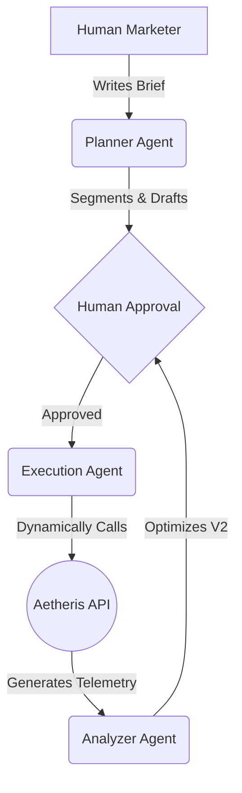

<h1 align="center">Aethris <br/> <span style="font-size: 0.6em; font-weight: 500;">Advanced Agentic AI Campaign Platform</span></h1>

<p align="center">
  <strong>Plan, execute, monitor, and autonomously optimize digital marketing campaigns using Gemini 2.5 Flash and LangGraph. Built for BFSI marketing teams who demand precision, automation, and human-in-the-loop control.</strong>
</p>

<p align="center">
  <a href="#features">Features</a> •
  <a href="#architecture">Architecture</a> •
  <a href="#tech-stack">Tech Stack</a> •
  <a href="#installation">Installation</a> •
  <a href="#usage">Usage</a>
</p>

---

## ⚡ Overview

Aetheris (formerly CampaignX Sentinel) is a comprehensive, production-ready AI platform designed to eliminate the manual overhead of digital marketing. By simply typing a natural language campaign brief, Aetheris's specialized AI agents take over: parsing your intent, pulling your live customer cohort, running intelligent demographic segmentations, drafting personalized email copy, and dispatching multi-wave A/B tests through autonomous API discovery.

Once a campaign is live, Aetheris doesn't stop. Its **Analytics Edge Agent** continuously ingests open-rate and click-rate telemetry to dynamically retarget underperforming segments and autonomously optimize the campaign's "Wave 2"—always keeping a human safely in the loop for final approvals.

---

## ✨ Core Capabilities

### 🧠 Agentic AI Planning
- **Context-Aware Parsing:** Give Aetheris a brief (e.g., "Launch our new Term Deposit for Seniors") and the Gemini-powered Planner Agent instantly extracts target demographics, constraints, and CTA goals.
- **Intelligent Segmentation:** Automatically slices large customer cohorts into optimized micro-segments for deep-tier A/B testing.

### ⚙️ Autonomous Execution
- **LangGraph Tool Discovery:** The Execution Agent dynamically lists, parses, and adapts to available external API tools.
- **Scheduled Dispatch:** Automatically calibrates the absolute best send times (in IST) based on previous cohort interactions.

### 📊 Live Telemetry & Optimization Workflow
- **Continuous Feedback Loop:** Analyzes Open Rates (30% weight) and Click Rates (70% weight) from previous campaign waves.
- **Wave 2 Auto-Correction:** Autonomously hallucinates new subject strategies, content tones, and adjusted send times for struggling demographic sectors before passing them back to the human operator for 1-click execution.

### 🛡️ Enterprise-Grade Security
- **Human-in-the-Loop:** All agent plans require firm `Approve / Reject` gating before any live API executions occur.
- **Firebase Auth Integration:** Secure backend gateway locking platform access to verified marketing personnel.

---

## 🏗️ Architecture

Aetheris utilizes an advanced multi-agent orchestrator written in Python and LangChain, bridged to a blazingly fast React frontend.

1. **Planner Agent (`agents/planner.py`):** Ingests Brief -> Emits JSON Schema Plan.
2. **Execution Agent (`main.py`):** Uses LangGraph `create_react_agent` to discover capabilities and interact with campaign endpoints.
3. **Analyzer Agent (`agents/analyzer.py`):** Ingests Telemetry -> Re-segments -> Emits Wave 2 JSON.



---

## 💻 Tech Stack

### Frontend (User Interface)
- **Framework:** React + Vite
- **Styling:** Custom "Deep Space" CSS Architecture (Glassmorphism, CSS Variables, Responsive)
- **State Management:** React Hooks
- **Authentication:** Google Firebase Auth

### Backend (Agentic Engine)
- **Framework:** FastAPI (Python)
- **AI/LLM Core:** Google Gemini 1.5 Flash (`langchain-google-genai`)
- **Agent Orchestration:** LangChain & LangGraph
- **HTTP Client:** `httpx` for seamless external API interactions

---

## 🚀 Installation & Setup

### Prerequisites
- Python 3.10+
- Node.js 18+
- Active Gemini API Key
- Firebase Project setup

### 1. Setting up the Backend
```bash
# Navigate to the backend directory
cd backend

# Create a virtual environment
python -m venv venv
venv\Scripts\activate  # Windows
source venv/bin/activate # Mac/Linux

# Install dependencies
pip install -r requirements.txt

# Create your environmental variables 
# backend/.env
GEMINI_API_KEY=your_gemini_key_here
CAMPAIGN_API_BASE=https://campaignx.inxiteout.ai
CAMPAIGN_API_KEY=your_campaign_key

# Run the FastAPI server
python -m uvicorn main:app --reload --port 8000
```

### 2. Setting up the Frontend
```bash
# Navigate to the frontend directory
cd frontend

# Install dependencies
npm install

# Setup your Firebase config inside src/firebase.js

# Start the Vite development server
npm run dev
```

---

## 📖 Usage Workflow

1. **Sign In:** Use your Google Auth credentials on the Aetheris splash page.
2. **Draft a Brief:** Inside the Campaign Studio, explain what you want to sell. Use natural language. (e.g. "We need to promote our new high-yield savings account to active millennials.")
3. **Review AI Plan:** The AI generates an extensive plan mapping out target cohorts, generated email copy, and optimized send times.
4. **Approve:** Click Accept. The LangGraph agent executes the campaign autonomously to the backend.
5. **Optimize:** Click the "AI Analyze & Optimize" button. The Analyzer edge agent reads the telemetry return, discovers underperforming clusters, and queues up a highly-tailored Wave 2 sequence.
6. **Review Global Analytics:** Navigate to the `Analytics` tab on the sidebar to view aggregate funnel conversions.

---

<p align="center">
  <br>
  Developed with ❤️ for FrostHack XPECTO 2026.
</p>
